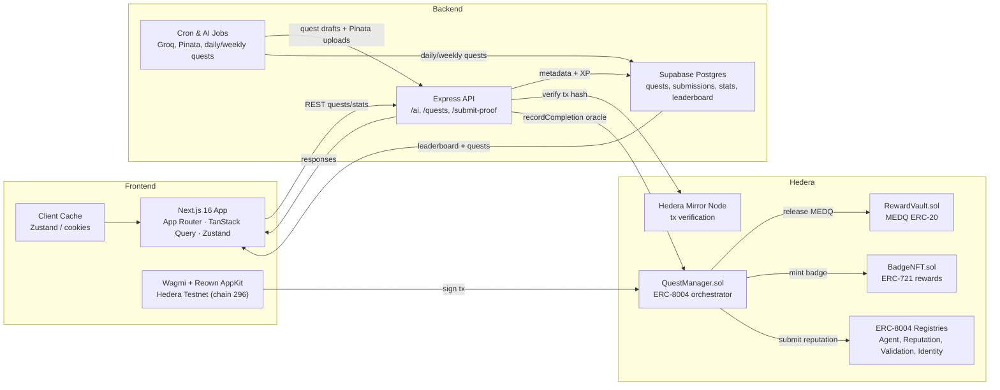

# Medq Quest – DeFi Gamification on Hedera

Medq Quest turns Hedera DeFi actions into tiered quests, verifies proofs through the Mirror Node, then distributes MEDQ rewards and badge NFTs via ERC‑8004 smart contracts. The project targets **Hedera Hello Future: Ascension Hackathon 2025**, **Theme 2 – DeFi & Tokenization**.

---

## 📌 Project Summary
Medq Quest is an on-chain quest platform on Hedera that combines an AI quest generator with automatic proof verification. Users accept DeFi quests (swap, stake, lend), submit a transaction hash as evidence, have it verified via Mirror Node, and automatically receive MEDQ + badge NFTs from the QuestManager contract.

---

## 🚀 Hackathon Track & Problem Statement
- **Track**: Theme 2 – DeFi & Tokenization  
- **Problem Statement**: Intermediate – DeFi Gamification (turn DeFi activities into quests with on-chain rewards)

---

## 🧠 Problem & Why It Matters
- **Fragmented onboarding** – New Hedera users find it hard to discover meaningful DeFi actions beyond simple swaps.  
- **Web2 loyalty isn’t portable** – Centralized XP/reward systems can’t prove on-chain effort or transfer reputation.  
- **Need for transparent incentives** – Ecosystem partners want verifiable engagement metrics (XP, quests completed, tx volume) directly on Hedera.

Why Hedera? Low fees, predictable finality, and ERC‑8004 agent tooling let us orchestrate verifiable quests with micro-rewards, something impractical on Web2 or high-fee L1s.

---

## 💡 Solution Overview
Medq Quest orchestrates ERC‑8004 agents, AI quest generation, and Hedera-native rewards to gamify DeFi actions.

**Key features**
- AI quest generator (Groq + Hedera Agent Kit)  
- Quest lifecycle (create → accept → submit proof → auto completion)  
- Mirror Node verification to guard against fake proofs  
- MEDQ ERC-20 payout + BadgeNFT ERC-721 mint for every completion  
- Supabase-backed XP, leaderboard, and profile completion  
- Daily/weekly quests tailored to user wallet activity

---

## 🏗️ Architecture Diagram




---

## 🛠 Tech Stack
| Layer | Tech |
| --- | --- |
| Frontend | Next.js 16 (App Router), React 19, Tailwind CSS 4, Wagmi + Reown AppKit, TanStack Query, Zustand |
| Backend | Express 5 + TypeScript, Supabase JS, Groq, Pinata IPFS, Viem, Zod |
| Smart Contracts | Foundry, Solidity ^0.8.20, ERC‑8004 adapters, QuestManager, RewardVault, BadgeNFT |
| Infra | Supabase (Postgres + functions), Hedera Hashgraph Testnet, Groq API, Pinata |

---

## 🔗 Hedera Integrations
- **Smart Contract Service (EVM)** – QuestManager (ERC‑8004 compatible) orchestrates quests; RewardVault holds MEDQ ERC‑20 balances; BadgeNFT mints ERC‑721 reward NFTs.  
- **JSON-RPC + Mirror Node** – Backend verifies submitted transaction hashes via Mirror Node before calling `recordCompletion`.  
- **Wallet support** – Reown/Wagmi enforces Hedera Testnet (chain id 296) so users sign via JSON-RPC compatible wallets.  
- **Planned** – Add Hedera Consensus Service for immutable quest audit logs and event streaming.

---

## 📂 Repository Structure
```
.
├── backend/                     # Express + Supabase + Groq AI backend
│   ├── src/                     # routes, services, cron jobs, lib
│   ├── database/                # Supabase schema & helpers
│   ├── env.example              # backend env template
│   ├── package.json
│   └── README.md
├── contracts/                   # Foundry workspace (QuestManager, RewardVault, BadgeNFT)
│   ├── src/                     # Solidity sources
│   ├── script/                  # Deploy scripts (Deploy.s.sol)
│   ├── test/                    # Foundry tests
│   ├── lib/                     # git submodules (hedera-smart-contracts, OZ, forge-std)
│   ├── foundry.toml
│   └── README.md
├── src/                         # Next.js 16 application code
│   ├── app/                     # App Router routes
│   ├── components/              # UI + shared components
│   ├── data/                    # mock data + constants
│   ├── hooks/                   # client hooks (wagmi, quests, etc.)
│   └── lib/                     # API client, store, contract helpers
├── public/                      # Static assets (favicons, future architecture diagram)
├── components.json              # shadcn/ui config
├── next-env.d.ts                # Next.js type definitions
├── next.config.ts               # Next.js configuration
├── package.json                 # frontend scripts & deps (root)
├── package-lock.json
├── postcss.config.mjs
├── tsconfig.json
├── REOWN_SETUP.md               # Wallet setup steps
└── README.md                    # Hackathon-focused overview (this file)
```

---

## ⚙️ Installation & Setup

1. **Clone the repo**
   ```bash
   git clone https://github.com/demigohu/medq.git
   cd medq
   ```

2. **Contracts – build & deploy (Quest stack + ERC‑8004)**
   ```bash
   cd contracts
   forge install hashgraph/hedera-smart-contracts
   forge install OpenZeppelin/openzeppelin-contracts
   forge install foundry-rs/forge-std
   forge build
   forge script script/Deploy.s.sol \
     --rpc-url testnet \
     --skip-simulation \
     --broadcast
   ```
   `Deploy.s.sol` orchestrates the full stack: deploys the ERC‑8004 helper suite (`AgentRegistryAdapter`, `ReputationRegistry`, `ValidationRegistry`, `IdentityRegistry`), `RewardVault` (ERC‑20 MEDQ), `BadgeNFT` (ERC‑721), and `QuestManager`, then wires them together (vault ownership, NFT references, registry addresses) and immediately sets the completion-oracle address provided via env/args. Capture all emitted addresses for later use (backend env + Supabase seed).

3. **Register quest agent/oracle**
   - Using your preferred method (cast, script, or Guardian UI), call the ERC‑8004 `AgentRegistryAdapter` to register the quest agent controller address.
   - Confirm the deploy script set your completion oracle; if not, call `QuestManager.setCompletionOracle(<backend wallet>, true)`.
   - Fund `RewardVault` with MEDQ ERC‑20 so quests can pay out rewards.

4. **Environment variables**
   - Copy `backend/env.example` → `backend/.env` and fill in RPC URL, controller keys, deployed contract addresses, Supabase, Groq, Pinata, Mirror Node URLs.
   - Create `frontend/.env.local` with `NEXT_PUBLIC_API_URL`, `NEXT_PUBLIC_REOWN_PROJECT_ID`, and `NEXT_PUBLIC_APP_URL`.

5. **Install dependencies**
   ```bash
   #frontend
   npm install

   #backend
   cd backend && npm install
   ```

6. **Run services**
   ```bash
   # backend API
   cd backend
   npm run dev

   # frontend (in another terminal)
   cd ../
   npm run dev
   ```
   Frontend runs on `http://localhost:3000`, backend on `http://localhost:4000`. Wagmi/Reown automatically prompts Hedera Testnet (chain id 296).

---

## 🔑 Environment Variables
Update `.env`, `backend/.env`, and `contracts/.env` using the templates below.

### Frontend (`.env`)
```
NEXT_PUBLIC_API_URL=http://localhost:4000
NEXT_PUBLIC_QUEST_MANAGER_ADDRESS=0x...
NEXT_PUBLIC_REOWN_PROJECT_ID=your_walletconnect_project_id
NEXT_PUBLIC_MEDQ_TOKEN_ADDRESS=0x...
NEXT_PUBLIC_BADGE_NFT_ADDRESS=0x...
```

### Backend (`backend/.env`)
```
# RPC Configuration
RPC_URL=https://testnet.hashio.io/api

# Contract Addresses
QUEST_MANAGER_ADDRESS=
REWARD_VAULT_ADDRESS=
BADGE_NFT_ADDRESS=
REPUTATION_REGISTRY_ADDRESS=
VALIDATION_REGISTRY_ADDRESS=
AGENT_REGISTRY_ADAPTER_ADDRESS=

# Completion Oracle Address
COMPLETION_ORACLE=

# Agent Controller Private Key
AGENT_CONTROLLER_PRIVATE_KEY=

# Completion Oracle Private Key
COMPLETION_ORACLE_PRIVATE_KEY=

# External Services
GROQ_API_KEY=
PINATA_JWT=

# Mirror Node (Hedera Testnet)
MIRROR_NODE_URL=https://testnet.mirrornode.hedera.com/api/v1

# Supabase
SUPABASE_URL=
SUPABASE_SERVICE_ROLE_KEY=

# Server Port (optional, default: 4000)
PORT=4000
```

### Contracts (`contracts/.env`)
```
# Network Configuration
HEDERA_RPC_URL=https://testnet.hashio.io/api
PRIVATE_KEY=0x...

# Completion Oracle Address
COMPLETION_ORACLE=0x...

# Identity Contract Address
IDENTITY_REGISTRY_ADDRESS=0x...
# Agent Controller Address
AGENT_CONTROLLER_ADDRESS=0x...
# Agent Metadata Uri
AGENT_METADATA_URI=ipfs://
```

---

## 🧪 Testing
```bash
# Backend tests
cd backend
npm test
npm run test:watch
npm run test:coverage
npm run test:flow   # end-to-end API sanity

# Smart contracts
cd ../contracts
forge build
forge test
```
Frontend currently relies on manual QA; Cypress suite is planned post-hackathon.

---

## 🎮 How to Use the App
1. **Connect wallet** via the Reown modal (MetaMask + HashPack supported).  
2. **Complete profile** (name + email) so daily/weekly quests can be generated.  
3. **Browse quests** under `/quests`.  
4. **Perform DeFi action** on the target protocol (swap, stake, lend).  
5. **Submit proof** (tx hash) via the quest card; backend verifies via Mirror Node and triggers on-chain completion.  
6. **Claim rewards** – MEDQ + badge NFT minted automatically; XP/leaderboard update.  
7. **Track progress** on the profile page or leaderboard tab.

---

## 🌐 Deployment

- **Deployed addresses (Hedera Testnet)**  
  | Component | Address |
  | --- | --- |
  | IdentityRegistry | `0x36dE27419Ae1f0AfA86E6644be64F8627273e22f` |
  | ReputationRegistry | `0x0387d9685Ba5F06dc8F4BaC93e689546BCEEc133` |
  | ValidationRegistry | `0x63d0f398d437191A4aE014E5CC844B094a5C5726` |
  | AgentRegistryAdapter | `0xE8090831Dc6F786f238f6FED55Fe3BfD072C8D44` |
  | MedqToken (ERC‑20) | `0x7b2ff9782b29EeED547E43260Fbf8250D8527c3B` |
  | RewardVault | `0x799C3db5118Fdc6Bf7e254b1662AaeB8a49ccaE5` |
  | BadgeNFT (ERC‑721) | `0xc991Bac9a471CB8ab541eCE23Df603f51f84BFbE` |
  | QuestManager | `0x6364FBDa4469b6f84E3F2760aC5ac66c193B152b` |
  | Completion Oracle | `0xfDf033Ed041ce4F70c534fF8d79ac7B05681f9bc` |
  | Agent Controller | `0x8d50302F424f23f0B21c63B316b1a5308535b8BE` |

- **Live demo**: [Medq App](https://medq.space)  
- **API base**: _https://api.medq.space_  

---

## 🎥 Demo Assets
- **Live Demo URL**: [Medq App](https://medq.space)
- **Video Demo (YouTube)**: [Video Demo](https://youtu.be/wg6cnwwSqT8) 
- **Pitch Deck (PDF)**: [Pitch Deck](https://www.canva.com/design/DAG5V0cF0Do/F8K48tVjqYH88-NSHA0sTQ/edit?utm_content=DAG5V0cF0Do&utm_campaign=designshare&utm_medium=link2&utm_source=sharebutton)  
---


## 🗺 Roadmap (Post-Hackathon)
- **Q1 2026** – Expand Hedera Agent Kit flows for multi-agent quest curation and protocol-specific templates.  
- **Q2 2026** – MEDQ staking & DAO-style quest governance (voting on quest budgets, reward multipliers).  
- **Q3 2026** – Mobile app + push notifications via WalletConnect/XMTP; richer quest analytics in dashboards.  
- **Q4 2026** – Protocol marketplace so partners can publish quests, attach budgets, and track ROI.  
- **Always-on** – Observability (Supabase CDC → Grafana) plus Mirror Node health monitors to ensure verification SLAs.

---

## 👥 Team
| Member | Role | Contact |
| --- | --- | --- |
| _demigohu_ | Smart Contracts & Backend | [LinkedIn](https://www.linkedin.com/in/tegaraji/) [Twitter/X](https://x.com/demigohu) |
| _garrybad_ | Frontend & UX | [LinkedIn](https://www.linkedin.com/in/muhammad-garry/) [Twitter/X](https://x.com/itsktoru) |

---

## 🤝 License
Copyright Medq Quest team. Final license will follow hackathon requirements (default MIT unless specified).

---

## 📮 Contact
    
- [Twitter/X](https://x.com/medqdefi)
